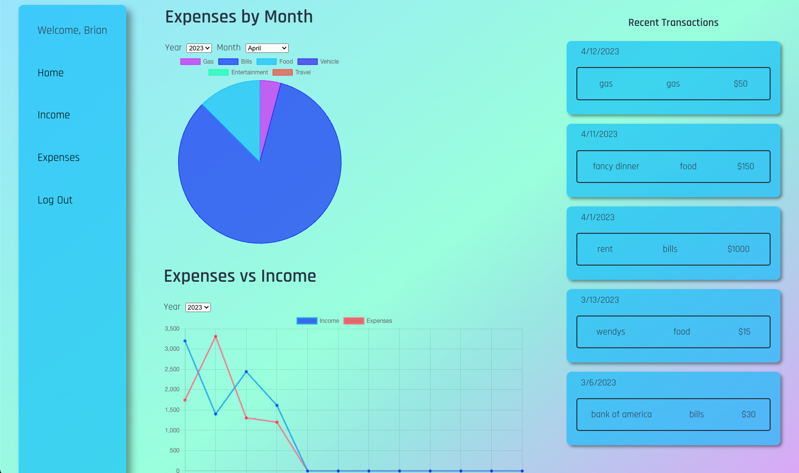
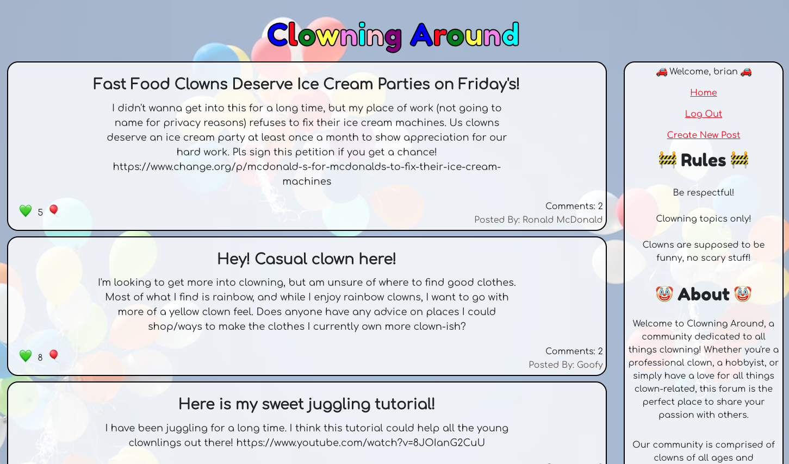
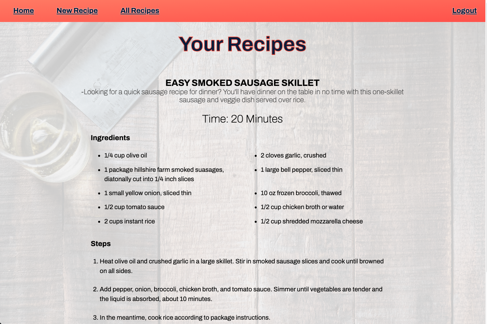
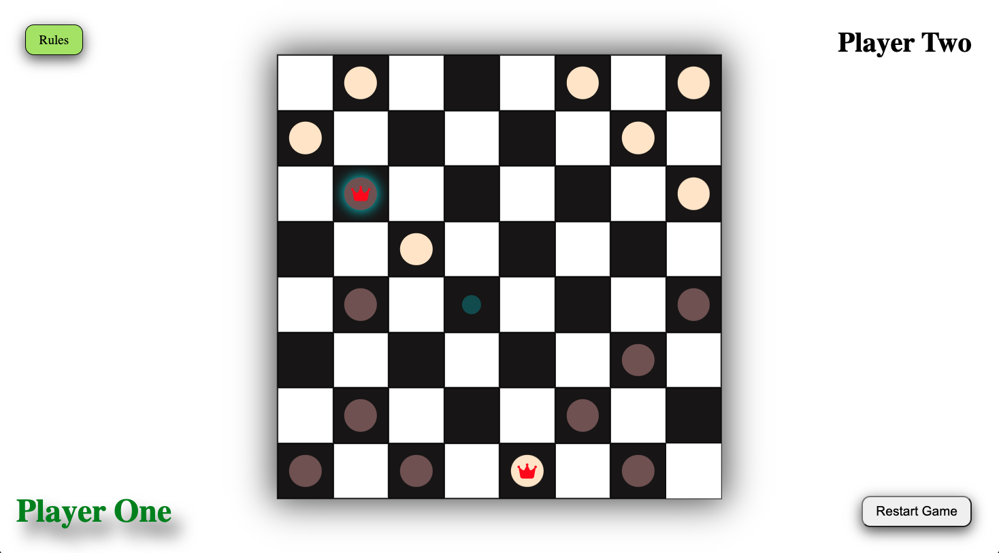

# About Me

I have always been a naturally curious person, who loved finding out how things worked under the hood. After many years in the world of logistics I decided to push myself and try and get into an industry that I was more passionate about. I learned Python a few years ago as a hobby and fell in love with programming. Since then I have got into the world of web development and have been building apps to strengthen my knowledge. I am very passionate about learning new things and love keeping myself busy.

## Skills

| Skills     |            |
| ---------- | --------   |
| React      | NodeJs     |
| Express    | MongoDB    |
| Heroku     | Git        |
| JavaScript | PostgreSQL |
| HTML5      | CSS3       |
| Python     | Bash       |
| Firebase   | Linux      |
| VScode     |            |

## Actively Learning

| Learning      |
| ------------- |
| Java          |
| IntelliJ IDEA |
| Vim Motions   |

## Projects

### [Expense and Income Tracker](https://expense-tracker-client-99oc.onrender.com)

This app is used to have a convenient place to keep track of all of your expenses and income. It incorporats ChartJS to allow you to visualize your spending habits based on different categories and see where all of your hard earned money is going. You can also keep track of your income and see how that compares to your expenses for each month.

 

#### Co Authors: [Mitchell Banrey](https://github.com/mbanrey) 
---

### [Clowning Around Forum](https://clowning-around-client.onrender.com/)

Clowning Around is a lighthearted clown forum website that was completed as a team by me and 3 other developers. It is a full stack MERN app and incorporates all of the functionality that you would expect from a forum. This was definitely one of the more entertaining project that I have worked on and is usually good to get a few laughs. Feel free to drop in and share your favorite clown related post.

 

#### Co Authors: [Michael DiFelice](https://github.com/StandardDemacian), [Honesty Moore](https://github.com/honestymoore), [Greg Harmon](https://github.com/gharmon327) 

---

### [Recipe Tracker](https://briant1312.github.io/project-2-client/)

I taught myself how to cook years ago and love trying out new recipes. Naturally for one of my projects I had to build an app that would allow me to keep track of recipes that I have made in the past. This is a full stack application written with vanilla JS, CSS, HTML for the front end and Express and Mongoose for the backend.

 

---

### [Checkers](https://briant1312.github.io/project-1/)

I've always been a fan of board games so I wanted to create one for one of my projects. I created checkers which incorporates all of the official rules of the game including king pieces and forced captures. Game logic can be very confusing so this was definitely a fun challenge to get everything working. Grab a friend and try it out.

 