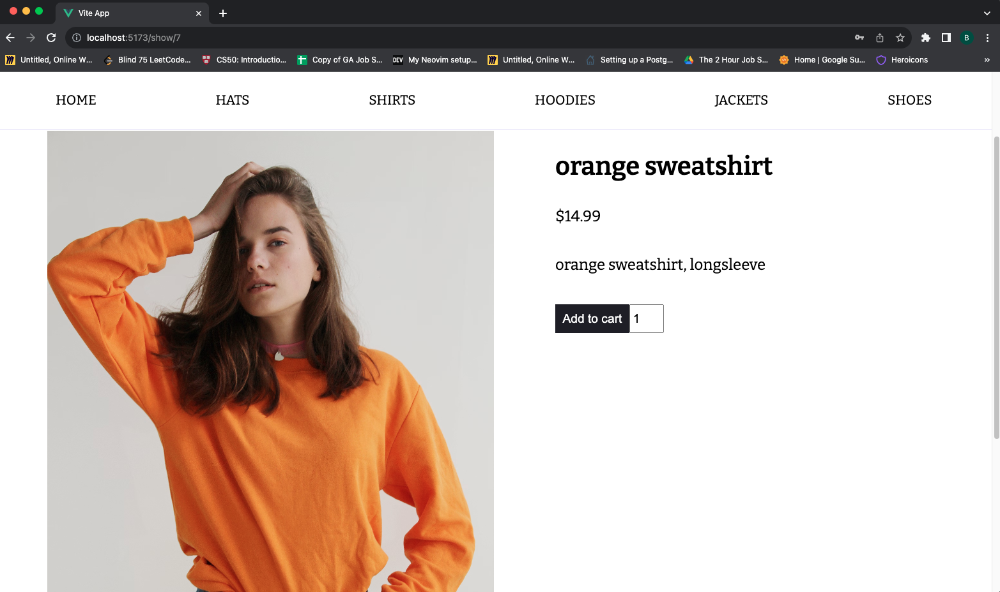
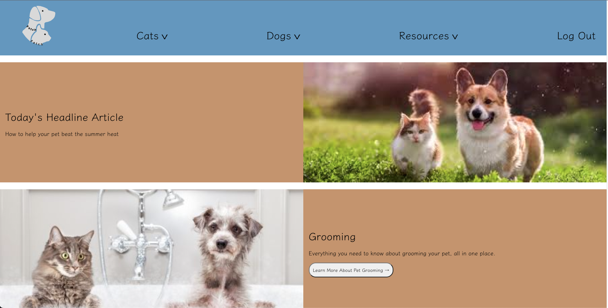
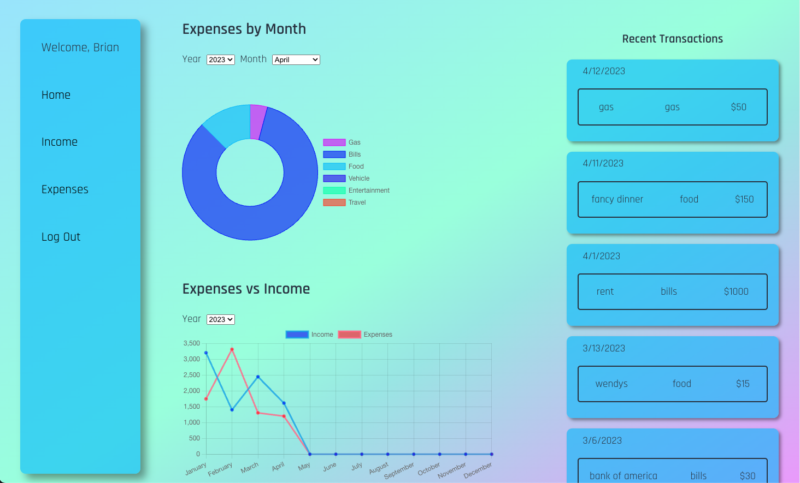

# About Me

I have always been a naturally curious person, who loved finding out how things worked under the hood. After many years in the world of logistics I decided to push myself and try and get into an industry that I was more passionate about. I learned Python a few years ago as a hobby and fell in love with programming. Since then I have got into the world of web development and have been building apps to strengthen my knowledge. I am very passionate about learning new things and love keeping myself busy.

## Skills

| Skills     |            |
| ---------- | --------   |
| React      | NodeJs     |
| Express    | MongoDB    |
| Heroku     | Git        |
| JavaScript | PostgreSQL |
| HTML5      | CSS3       |
| Python     | Bash       |
| Firebase   | Linux      |
| VScode     | Vue        |

## Projects

### [Merch](https://merch-kpad.onrender.com/)

Merch is a dummy ecommerce website built with Vue, Express, and PostgreSQL. I always enjoy learning new things so I taught myself Vue while building this app. You can browse items, add / remove things from your cart, checkout and view past orders.  I used pg-promise for the ORM as recommended by Express docs and wrote out the tables with a plain SQL file (pg-promise does not have any way of managing models). 

 

[Frontend Repo](https://github.com/briant1312/ecommerce-frontend)

[Backend Repo](https://github.com/briant1312/ecommerce-backend)

---

### [Fetch](https://pet-front-end.onrender.com/)

This was a hackathon project that I completed with 3 other developers and one UX designer. Fetch is meant to be a place for pet owners to be able to find and save resources to help with caring for their pets. It was built with the MERN stack using SASS for styling. This was my first experience getting to work with a designer and was a lot of fun getting to bring someone elses ideas to life.

 

[Frontend Repo](https://github.com/briant1312/pets-frontend)

[Backend Repo](https://github.com/briant1312/pet-server)

#### Co Authors: [Cindy Wong](https://github.com/cindywongdev), [Aaron Daley](https://github.com/trble91), [Greg Harmon](https://github.com/gharmon327) 

---

### [Expense and Income Tracker](https://expense-tracker-client-99oc.onrender.com)

This app is used to have a convenient place to keep track of all of your expenses and income. It incorporats ChartJS to allow you to visualize your spending habits based on different categories and see where all of your hard earned money is going. You can also keep track of your income and see how that compares to your expenses for each month.

 

[Github Repo](https://github.com/briant1312/project-4)

#### Co Authors: [Mitchell Banrey](https://github.com/mbanrey) 
---

### [Clowning Around Forum](https://clowning-around-client.onrender.com/)

Clowning Around is a lighthearted clown forum website that was completed as a team by me and 3 other developers. It is a full stack MERN app and incorporates all of the functionality that you would expect from a forum. This was definitely one of the more entertaining project that I have worked on and is usually good to get a few laughs. Feel free to drop in and share your favorite clown related post.

 

[Github Repo](https://github.com/briant1312/project-3-Clowning-Around)

#### Co Authors: [Michael DiFelice](https://github.com/StandardDemacian), [Honesty Moore](https://github.com/honestymoore), [Greg Harmon](https://github.com/gharmon327) 

---

### [Recipe Tracker](https://briant1312.github.io/project-2-client/)

I taught myself how to cook years ago and love trying out new recipes. Naturally for one of my projects I had to build an app that would allow me to keep track of recipes that I have made in the past. This is a full stack application written with vanilla JS, CSS, HTML for the front end and Express and Mongoose for the backend.

 

[Frontend Repo](https://github.com/briant1312/project-2-client)

[Backend Repo](https://github.com/briant1312/project-2-server)

---

### [Checkers](https://briant1312.github.io/project-1/)

I've always been a fan of board games so I wanted to create one for one of my projects. I created checkers which incorporates all of the official rules of the game including king pieces and forced captures. Game logic can be very confusing so this was definitely a fun challenge to get everything working. Grab a friend and try it out.

 

[Github Repo](https://github.com/briant1312/project-1)